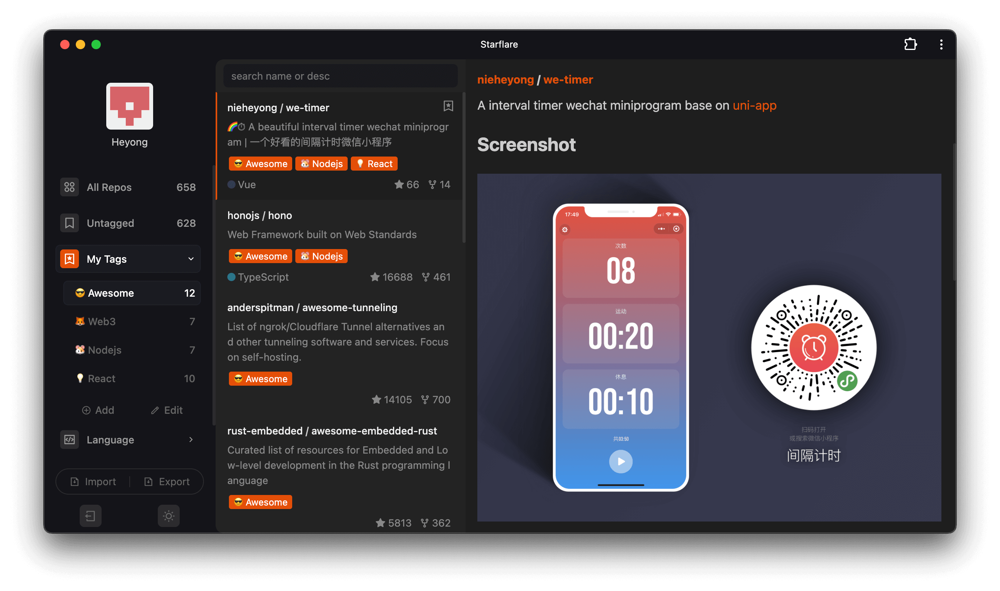
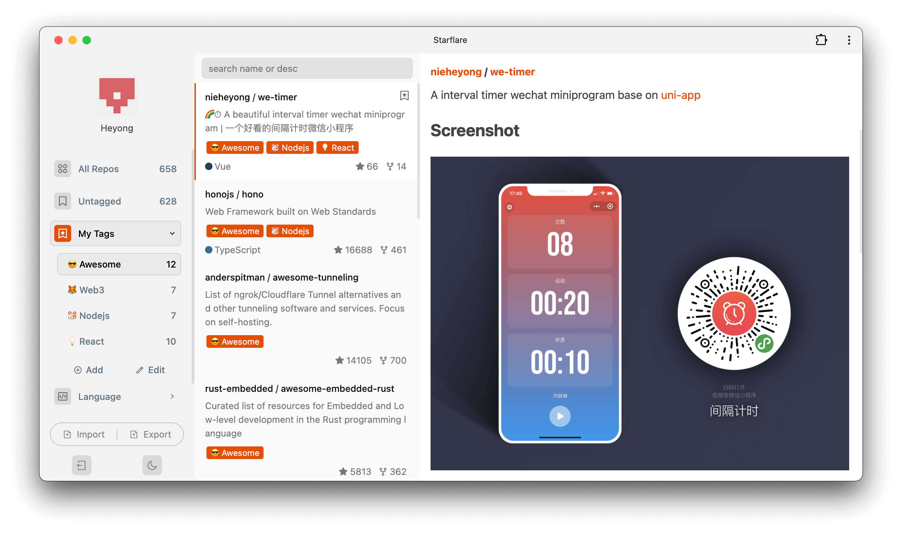

# ✨ Starflare

[中文README.md](README_CN.md)

Starflare is a sleek 和 efficient web application that empowers you to manage your GitHub stars with ease. 🌟 Organize, search, 和 discover your starred repositories effortlessly. Try it out now at [starflare.app](https://starflare.app)!

> ⚠️ **Important Note on Data Persistence:** Starflare currently stores data within your browser's local storage. This means that clearing your browser data or using a different browser/device will result in data loss. To ensure your data's longevity, we highly recommend regularly exporting your data as a backup.

## Preview 📸

[Demo Video 🎥](https://github.com/nieheyong/starflare/assets/9368693/81e3a5d3-6c2c-4b87-9897-22fe9c02ca7b)

## Features 🚀

*   🏷️ **Create and Manage Tags:** Organize your starred repositories with custom tags.
*   🏷️ **Add Tags to Repositories:**  Easily assign tags to your stars for quick categorization.
*   🔍 **Instant Search:** Find the repository you're looking for in a flash.
*   📱 **Installable PWA:** Install Starflare as a Progressive Web App for a native app-like experience.
*   ☁️ **Deploy on Cloudflare:** Host your own instance of Starflare on Cloudflare Pages with ease.
*   🌙 **Dark Mode Support:** Enjoy a comfortable viewing experience in low-light conditions.
*   ☀️ **Light Mode Support:** Switch to a bright and vibrant interface when you prefer.

## Deployment on Cloudflare Pages ⚙️

Starflare can be easily deployed to Cloudflare Pages. Follow these steps:

1. **Fork the Repository:** Fork this repository to your own GitHub account.

2. **Create a GitHub OAuth Application:**
    *   Go to your GitHub Developer settings: [https://github.com/settings/developers](https://github.com/settings/developers)
    *   Click "New OAuth App".
    *   Fill in the following details (replace placeholders with your information):
        *   **Application name:** `Starflare` (or a name of your choice)
        *   **Homepage URL:** `https://<your-username>.github.io/starflare` (or your custom domain if you have one, replace your-username with your github username)
        *   **Authorization callback URL:** `https://<your-username>.github.io/starflare/#/login` (replace your-username with your github username)
    *   Click "Register application".
    *   Copy the **Client ID** and generate a new **Client Secret**. You'll need these in the next step.

3. **Deploy to Cloudflare Pages:**
    *   Go to your Cloudflare dashboard and select "Workers & Pages".
    *   Click "Create application".
    *   Choose "Pages" and connect your forked Starflare repository.
    *   **Important:** In the "Build settings"
      *   **Framework preset:** `Vue`
      *   **Build command:**  `npm run build`
      *   **Build output directory:** `/dist`

4. **Environment Variables:**
    *   In the Cloudflare Pages dashboard for your project, go to "Settings" -> "Environment Variables".
    *   Add the following environment variables (replace placeholders with your actual values):

        | Variable Name   | Value                                    |
        | :-------------- | :--------------------------------------- |
        | `CLIENT_ID`     | Your GitHub OAuth App's Client ID        |
        | `CLIENT_SECRET` | Your GitHub OAuth App's Client Secret   |
        | `NODE_VERSION`  | `16.20.0`                               |
        | `YARN_VERSION`  | `1.22.19`                               |

5. **Configure `.env`:**
    *   In your forked repository, edit the file `main/.env`.
    *   Update the `VUE_APP_CLIENT_ID` values with your GitHub OAuth App's credentials.

6. **Deploy 和 Enjoy!**
    *   Commit and push the changes to your forked repository. Cloudflare Pages will automatically build and deploy your Starflare instance.

## Similar Projects 🤝

Here are some other projects that offer similar functionality:

*   [Gitstars](https://github.com/cfour-hi/gitstars)
*   [Astral](https://github.com/astralapp/astral)
*   [GitHub Stars Manager](https://github.com/raythunder/github-stars-manager)

## Contributing 👥

Contributions are welcome! If you have any ideas, bug fixes, or feature requests, please feel free to open an issue or submit a pull request.

